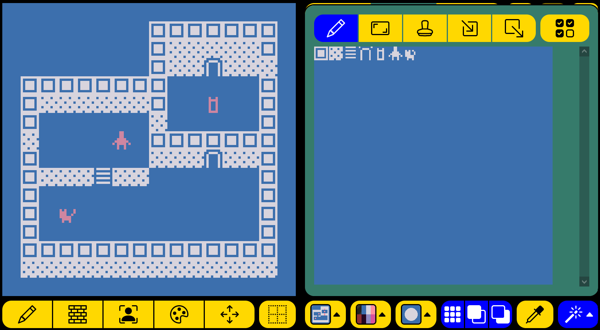
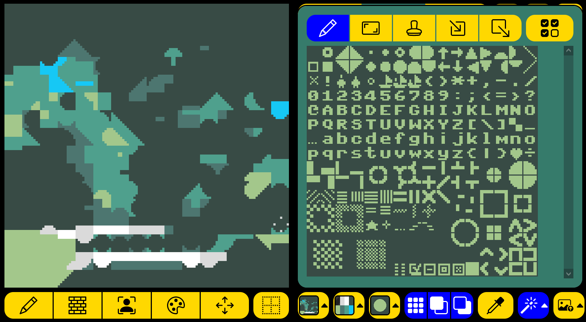

# bipsi-plugins
Plugins for [bipsi](https://github.com/Ragzouken/bipsi)

## magic-tools
Adds new drawing tools to bipsi for easier room creation.

### How to use
1. Create a new event on any location in your bipsi room, choose import plugin and import magic-tools.js file.
2. Go to Draw tile. A new button with a magic wand appears on the bottom right. 
3. The whole tileset is displayed. 
4. The new drawing tools on top include, from left to right:
- Draw
- Draw filled rectangle
- Stamp: paste tiles from the tileset in their original relative position (useful for elements based on multiple tiles)
- Copy: select a rectangular area
- Paste: copy this rectangle.
- Multiple select/random: when activated, multiple tiles can be selected. Draw and rectangle will then pick randomly from then when drawing. Useful for variations such as flowers on a map.

### Displaying the tileset
Originally, this is for large assets, usually a 16x16 grid of 256 tiles (each being 8x8 pixels).

### Supported options 
The field "magic-options" supports special options in JSON format
- "keepColors": false - set it to true is you want to use color tiles, typically in conjunction with the [import-image](https://github.com/floriancargoet/bipsi-binksi-plugins/blob/main/dist/import-image.js) plugin which supports colored tilesets.
- "experimental":false - some experimental features like multi-frame animation (only works if you haven't created animations and for tilesets with tiles that haven't been manually reordered). Undocumented, unsupported, use at your own risk.

### Disclaimer
This plugin is provided as is and without any guarantee of support of any kind.

### Coding note
All my tools coexist with the original from Bipsi, which makes programming a little bit difficult.
To add new tools without modifying the tools' toolbar, I temporarily disable the toolbar by selecting an undefined tool through EDITOR.roomPaintTool.value. This way, no tool radio button is active.
Upon closing my window, the standard tile drawing tool gets reactivated.
